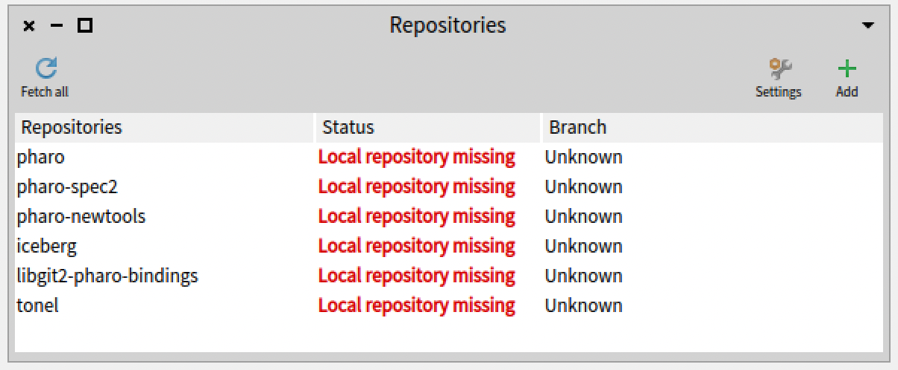
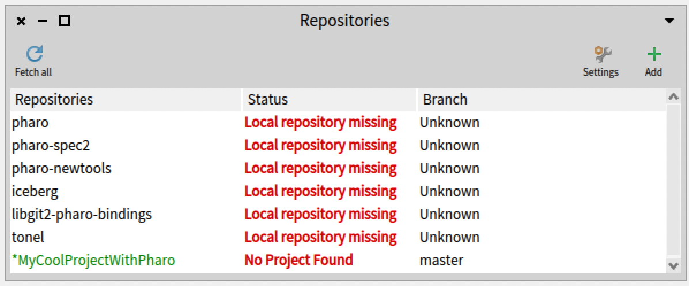
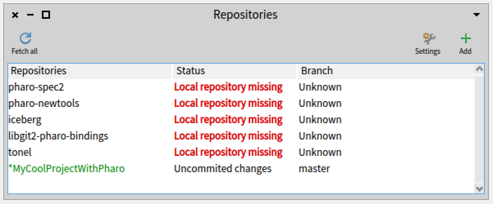
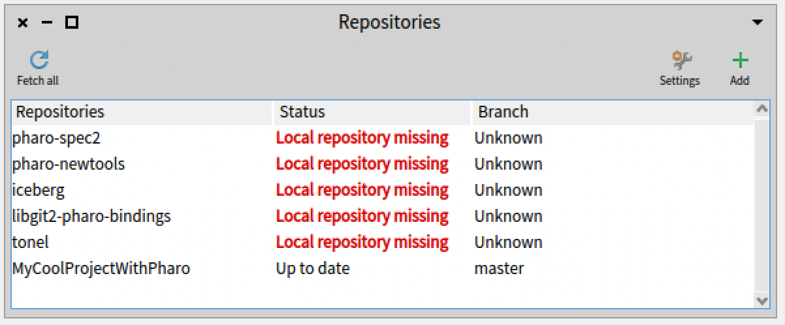

## Publishing and packaging your first Pharo project

@cha:Iceberg

In this chapter we will explain in more detail how you can publish your project on GitHub using Iceberg. Iceberg is a tool and library that supports the handling of Git repositories; it does more than just save and publish your files. Then we will briefly show how to make sure that you or other developers can load your code without having to understand its internal dependencies.

Note that this chapter has been written to be read in isolation - so you may see some repetitions to other chapters.

We will not explain basic concepts like commit, push/pull, merging, or cloning, please refer to a Git tutorial for this. A strong prerequisite for reading this chapter is that you must be able to publish from the command line to your Git hosting service. If you cannot, do not expect Iceberg to fix it for you. If you have some problems with your SSH configuration (which is the default way to push using GitHub) you can either use HTTPS instead, or read the _Manage your code with Iceberg_ booklet that you can find on [http://books.pharo.org](http://books.pharo.org). Let us get started.

### For the impatient


If you do not want to read through everything below, and you feel pretty confident, here is an executive summary of how to get your code published:

- Create a project on GitHub or any Git-based platform.
- \[Optional\] Configure Iceberg to use custom SSH keys.
- Add a project to Iceberg.
  - \[Optional (but strongly recommended)\] In the cloned repository, create a directory named `src` on your file system. This is a good convention.
- In Iceberg, open your project and add your packages.
- Commit your project.
- \[Optional\] Add a baseline to your project.
- Push your changes to the remote repository.


And you're done. But now let's explain these steps more calmly.

### Basic architecture


As Git is a distributed versioning system, you need a _local_ clone of the repository and a _working copy_. Your working copy and local repository are usually on your machine. Your changes to the working copy will be committed to the local repository before being pushed to your remote repository or repositories (Figure *@commit_in_workflow@*). Pharo complicates this situation a little, which is why we use Iceberg. In a nutshell, Pharo classes and methods are objects that get modified on the fly. When you modify a class source code, the Git working copy is not automatically modified. It is as though you have two working copies: the object one in your image, and the Git-file based one. Iceberg is here to help you synchronize and manage them both.



#### Create a new project on GitHub


While you can save locally first and then later create a remote repository, we're going to  create a new project on GitHub first -- we'll explain the other option later.

Figure *@onGithub@* shows the creation of a project on GitHub. The order does not really matter, but you will use different options when you add a repository to Iceberg as we will show later.



#### \[Optional\] SSH setup: tell Iceberg to use your keys


To be able to commit to your Git project, you should either use HTTPS or you will need to set up valid SSH credentials in your system. If you do use SSH (the default way), you will need to make sure those keys are available to your GitHub account, and that the shell adds them for smoother communication with the server.

Go to settings browser, search for "Use custom SSH keys" and enter your data there as shown in Figure *@UseCustom@*.



Alternatively, you can execute the following expressions in your image Playground or add them to your Pharo system preference file:


```
IceCredentialsProvider useCustomSsh: true.
IceCredentialsProvider sshCredentials
  publicKey: 'path\to\ssh\id_rsa.pub';
  privateKey: 'path\to\ssh\id_rsa'
```


!!note This method can also be used if you have a non-default key file. You just need to replace `id_rsa` with your file name.

Now we are ready to have a look at Iceberg the layer managing Git in Pharo.

### About Iceberg repository browser


Figure *@freshiceberg@* shows the top level pane for Iceberg. It shows that, for now, you do not have any projects defined or loaded. It shows the Pharo project (among others), but indicates that it could not find a local repository for it by displaying 'Local repository missing'.

First, don't worry about the missing repository for Pharo: you'll only need it if you want to contribute to the Pharo language project, which you're more than welcome to do but maybe let's finish this chapter first. Here's what's going on: the Pharo system does not know where the corresponding Git repository for its classes is. But Pharo works just fine without a local repository; you can still browse system classes and methods, and make changes, because Pharo has its own internal source management in the image. This warning just indicates that if you want to version Pharo system code using Git, then you should tell to the system where the local clone and working copy of Pharo are located on your local machine. But if you don't plan to modify and share the Pharo system code, you don't have to worry.




### Add a new project to Iceberg


The first step is to add a project to Iceberg:

- Press the **+** button to the right of the Iceberg main window.
- Select the source of your project. In our example, since you did not clone your project yet, choose the GitHub option.


Notice that you can either use SSH (Figure *@Cloning@*) or HTTPS (Figure *@CloningHTTPS@*).

This instructs Iceberg to clone the repository we just created on GitHub. We specify the owner, project, and physical location where the Git local clone and working copy will be on your disk.






Iceberg has now added your project to its list of managed projects and cloned an empty repository to your disk. 
You will see the status of your project, as in Figure *@FirstTimeCloned@*. Here is a breakdown of what you are seeing:

- `MyCoolProjectWithPharo` has a star and is green. This usually means that you have changes which haven't been committed yet, but may also happen in unrelated edge cases like this one. Don't worry about this for now.
- The Status of the project is **'No Project Found'** and this is more important. This is normal since the project is empty. Iceberg cannot find its metadata. We will fix this soon.




Later on, when you have committed changes to your project and you want to load it in another image by cloning it again, you will see that Iceberg will just report that the project is not loaded as shown in Figure
*@ProjectWithCommits@*.



#### Repair to the rescue


Iceberg is a smart tool that helps you fix the problems you may encounter while working with Git. As a general principle, each time you get a status with red text (such as **'No Project Found'** or **'Detached Working Copy'**), you should ask Iceberg to fix it using the **Repair** command.

Iceberg cannot solve all situations automatically, but it will propose and explain possible repair actions.
The actions are ranked from most to least likely to be right one. Each action offers an explanation and the consequences of using it. It is _always_ a good idea to read them. Setting up your repository the right way makes it extremely hard to lose any piece of code with Iceberg and Pharo, since Pharo contains its own copy of the code. Extremely hard... but not impossible. So pay attention!



#### Create project metadata


Iceberg reported that it could not find the project because some metadata was missing, such as the file encoding for your code, and the example location inside the repository. When we activate the repair command, we get Figure *@RepairFirst@*.  It shows the **Create project metadata** action and its explanation.

When you choose to create the project metadata, Iceberg shows you the filesystem of your project as well as the repository format as shown in Figure *@Tonel@*. Tonel is the preferred format for Pharo projects: it has been designed to work across multiple filesystems, so only change it if you know what you are doing!



Before accepting the changes it is a good idea to add a source folder to your repository, by convention `src`. Do that by pressing the **+** icon. You will be prompted to specify the folder for code as shown in Figure *@metadatasrc@*. Do not forget to select the `src` folder once you created it. 





If you commit at this point the project, Iceberg will show you the exact structure of your project as shown in Figure *@metadatasrc2@*. After accepting the project details, Iceberg shows you the files that you will be committing as shown in Figure *@PublishingMetaData@*.



Once you have committed the metadata, Iceberg shows you that your project has been repaired but has not been loaded, as shown in Figure *@ProjectWithCommits@*. This is normal since we haven't added any packages to our project yet. You can still push your changes to your remote repository at this point if you want to.

Your local repository is ready, let's move on to the next part.

### Add and commit your package using the 'Working copy' browser


Once your project contains Iceberg metadata, Iceberg will be able to manage it easily. Double click on your project to bring up a **Working copy** browser for your project. It lists all the packages that compose your project. Right now you have none. Add a package by pressing the **+** button as shown by Figure *@WithAPackage@*.



Again, Iceberg shows that your package contains changes that are not committed by using the green color and the star in front of the package name as showing in Figure *@Dirty@*.



#### Commit the changes


Commit the changes to your local repository using the Commit button as shown in Figure *@DirtyCleaned@*. Iceberg lets you chose the changed entities you want to commit. It might not be necessary but it's  an important feature. Iceberg will show the result of the commit action by removing the star and changing the color. It now shows that the code in the image is in sync with your local repository as shown by Figure *@DirtyBecomeClean@*. You can commit several times if needed.





#### Publish your changes to your remote


Publish your changes from your local directory to your remote repository using the **Push button**. You may be prompted for credentials if you used HTTPS.

When you push your changes, Iceberg will show you all the commits awaiting publication and will push them to your remote repository as shown in Figure *@Push@*. 



Now you're basically done. You know the essential aspects of managing your code with GitHub or any other remote Git service. Iceberg has been designed to guide you so please listen to it unless you really know what you are doing. You are now ready to use services offered by GitHub and others to improve your code control and quality!



### What if I did not create a remote repository?


We started by creating a remote repository on GitHub. Then we asked Iceberg to add a project by cloning it from GitHub. Now this is not the only order to proceed. You can create a local repository and version your code there and then once you create a remote repository on any Git platform, you will be able to push your code there. Now this is not the taks of Iceberg to create remote repository by registering to hosting platforms. Iceberge manages your code on Git and this is enough.

So let us see how do we do this the other way around, publishing our local project without a pre-existing remote repository. This is actually quite simple, so let's give it a whirl.

#### Create a new repository


When you add a new repository use the **New repository** option as shown in *@NewRepo@*.

#### Add a remote


If you want to commit to a remote repository, you will have to add it using the **Repository** browser. You can access this browser through the associated menu item or the icon. The Repository browser gives you access to the Git repositories associated with your project: you can access branches, manage them, and also add or remove remote repositories. Figure *@OpeningRepositoryBrowser@* shows the Repository browser on our project.



Pressing the **Add remote** button adds a remote; you just need to fill in the information that you can find in your remote Git project. Figure *@OpeningRepositoryBrowser11@* shows it for the sample project using SSH and Figure *@OpeningRepositoryBrowser2@* for HTTPS.





#### Push to the remote


Now you can push your changes and versions to the remote repository using the **Push** button. Once you have pushed you can see that you have one remote as shown in Figure *@PushedFromReport@*.



### Configuring Pharo to commit in HTTPS/SSH

@sec:Configure

We will now describe how to automatically configure Pharo to connect to github or other git related services. 
In the next section, we will describe how to create a baseline (a kind of map of your application and its package).
A baseline will make sure that you can reload your application and all its packages.

#### Startup actions

Pharo supports startup actions. Each time you will launch Pharo, Pharo will load some startup scripts and execute them. Basically all the file finishing by `.st` located in your Pharo preferences folder will be executed.
Some actions can be executed only once and others everytime. You can read more on this in the `StartupPreferencesLoader` class.


With recent version of github, to connect in HTTPS you should use a token. 
Now you can configure Pharo to store your token as well your github account authentification. 
In addition you can configure Pharo to point to your private and public SSH key as follows: 

The following script should be placed in a `.st` in your preferences folder (see below how to find it) 
and it will automatically configure Iceberg to connect to your accounts. Note that the first action of the script is to hide the Pharo logo. 
This way you can see if the startup script was executed.


```
StartupPreferencesLoader default executeAtomicItems: {
    StartupAction 
        name: 'Logo' 
        code: [ PolymorphSystemSettings showDesktopLogo: false] .
    StartupAction 
        name: 'Git Settings' 
        code: [ 
            Iceberg enableMetacelloIntegration: true.
            IceCredentialStore current
                    storeCredential: (IcePlaintextCredentials new
                    username: 'xxxxxJohnDoe';
                    password: 'xxxPassOfJohnDoe';
                    host: 'github.com';
                    yourself).
            IceCredentialsProvider sshCredentials
                username: 'git';
                publicKey: 'Path to your public rsa file (public key)';
                privateKey: 'Path to your private rsa file (private key)'.
            IceCredentialStore current
                storeCredential: (IceTokenCredentials new
                    username: 'xxxxxJohnDoe';
                    token: 'magictoken here ';
                    yourself) 
                forHostname: 'github.com'.
            ]. 
}
```



You should place this file in the preference folder that depends on your OS. 
You can find this folder by using the `System` menu and its `Startup/Version Preferences folder` item. 
To get the path of the folder, execute `self fullName` in the inspector opened by the menu item. You should then place 
the script in file named `xxx.st`. 



### Defining a `BaselineOf`

Versioning code is just the first part of making sure that you and other developers can reload your code. 
We describe now how to define a _Baseline_: a project map that you will use to define the dependencies within your project and its dependencies on other projects.


A Baseline is a description of a project architecture. You express the dependencies between your packages and other projects so that all the dependent projects are loaded without the user having to understand them or the links between them.

A baseline is expressed as a subclass of `BaselineOf` and packaged in a package named `'BaselineOfXXX'` (where 'XXX' is the name of your project). So if you have no dependencies, you can have something as simple as this:


```
BaselineOf subclass: #BaselineOfMyCoolProjectWithPharo
  ...
  package: 'BaselineOfMyCoolProjectWithPharo'
```



```
BaselineOfMyCoolProjectWithPharo >> baseline: spec
  <baseline>
  spec
    for: #common
    do: [ spec package: 'MyCoolProjectWithPharo' ]
```


Once you have defined your baseline, you should add its package to your project using the Working Copy browser as explained above. You should end up with something like Figure *@WithBaseline@*.

Now, commit it and push your changes to your remote repository.



More information about what you can achieve with Baseline is available on the Pharo wiki at: [https://github.com/pharo-open-documentation/pharo-wiki/](https://github.com/pharo-open-documentation/pharo-wiki/).

### Loading from an existing repository


There are several ways to load your versioned code into a new Pharo image:

#### Loading Baseline using Iceberg


To load a project interactively, you can use the **Metacello** menu item in Iceberg, seen when action-clicking the name of your repository. It lets you load a Baseline and execute it to load the project's packages. This way you are sure that all the required sub-projects are loaded.

Pay attention that the project you want to load should be already available in Iceberg (by adding its repository and Iceberg cannot guess where your project is located so it cannot magically guess it). 
Now if you just want to load the code and you do not care to have the project managed by Iceberg 
you can use a script as hereafter.

#### Manual load


Sometimes you may need to load a given package directly, or your project may not have defined a Baseline. You can use Iceberg to load a specific package as follows:

- Add the project using Iceberg as we previously explained.
- Open the "Working copy" browser by double clicking on the project in the Repositories browser.
- Select a package and manually load it.


#### Scripting the load


The second way is to use a Metacello script:


```
Metacello new
  baseline: 'MyCoolProjectWithPharo';
  repository: 'github://Ducasse/MyCoolProjectWithPharo/src';
  load
```


For projects with metadata, like the one we just created, that's all you have to do. Notice that we not only give the GitHub path but also the code folder (`src` in this case).

### Stepping back...


When working in Pharo on a package that's being managed with Iceberg, you need to understand that you are not editing your local working copy directly: you are actually modifying objects that represent classes and methods within the running Pharo environment. And so it's like you have two working copies: the running Pharo image and the Git working copy on disk.

When you use Git to manage your project outside of Pharo and Iceberg, with the `git` command line tool for instance, you need to remember that there is the code in the Pharo image _and_ the code in the working copy (and the code in your local clone). To update your image, you _first_ have to update your Git working copy and _then_ load code from the working copy to the image. To save your code you _first_ have to save the code in your image as files, _then_ add them to your Git working copy, and _then_ finally commit them to your clone.

The beauty of Iceberg is that it manages all of this for you transparently. All the tedious synchronization between the two working copies is done behind the scenes.

The architecture of the Iceberg system is as follows:

- You have your code in the Pharo image.
- Pharo is acting as a working copy (it contains the contents of the local Git repository).
- Iceberg manages the publication of your code to the Git working copy and the Git local repository.
- Iceberg manages the publication of your code to remote repositories.
- Iceberg manages the re-synchronization of your image with the Git local repository, Git remote repositories and the Git working copy.


### Conclusion


This chapter presented the most important aspects of how to publish and package your code correctly. This will help you to reload it in other images, as well as collaborate with other Pharo developers.
